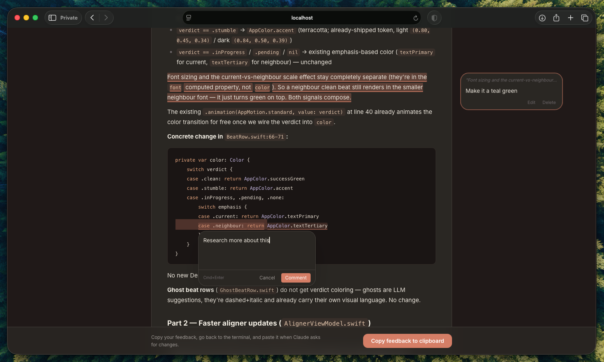

# cc-plan-viewer

A browser-based review UI for Claude Code plans. When Claude Code enters plan mode, a browser tab opens automatically showing the plan with proper markdown rendering, syntax highlighting, and inline commenting.

Select any text, add comments, copy your feedback to clipboard, and paste it back in the terminal.



## Install

```bash
npx cc-plan-viewer install
```

This copies the viewer to `~/.cc-plan-viewer/` and adds a PostToolUse hook to your Claude Code settings. Everything persists — no dependency on npm cache.

### Custom settings path

If you use a custom Claude Code configuration (e.g. aliases like `claude-work` with a different settings file):

```bash
npx cc-plan-viewer install --config ~/.claude-work/settings.json
```

## Update

```bash
npx cc-plan-viewer@latest update
```

Downloads the latest version from npm and updates the files in `~/.cc-plan-viewer/`. The hook in your settings stays the same — no reconfiguration needed.

## Uninstall

```bash
npx cc-plan-viewer uninstall
```

Removes the hook from settings and deletes `~/.cc-plan-viewer/`.

If you used a custom config path:

```bash
npx cc-plan-viewer uninstall --config ~/.claude-work/settings.json
```

## How it works

1. Claude Code writes a plan file (e.g. `~/.claude/plans/fancy-name.md`)
2. A PostToolUse hook detects the write and opens a browser tab
3. The plan renders with proper headings, code blocks, tables, and syntax highlighting
4. Select any text to add inline comments — they appear pinned to the right margin
5. Click **"Copy feedback to clipboard"** and paste it in the terminal when Claude asks

A lightweight local server runs on demand (port 3847) and auto-shuts down after 30 minutes of inactivity. No data leaves your machine.

## What gets installed

```
~/.cc-plan-viewer/
├── plan-viewer-hook.cjs   # PostToolUse hook script
├── server/                # Express server (compiled)
├── client/                # React SPA (built)
└── version.json           # Installed version info
```

Your `settings.json` gets one entry added to the `PostToolUse` hooks array. All existing settings are preserved.

## Requirements

- Node.js 18+
- Claude Code

## License

MIT
